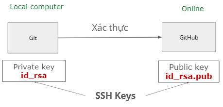
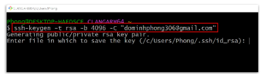
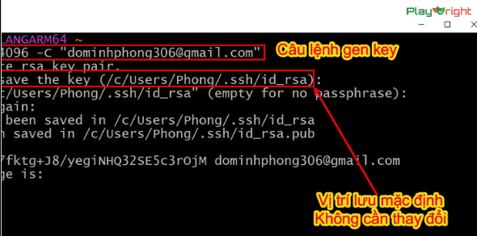
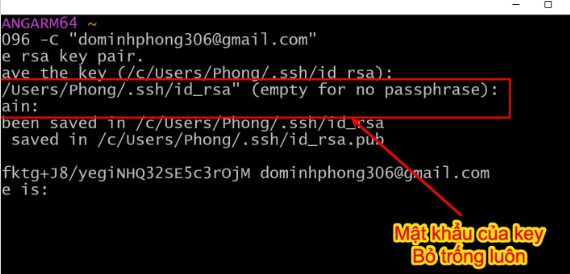
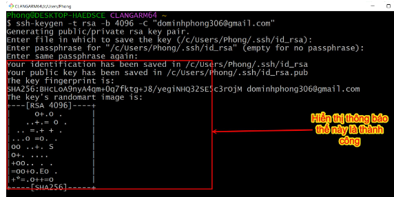
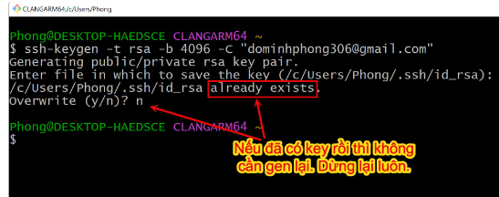
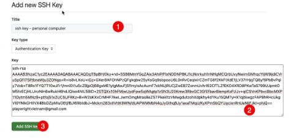
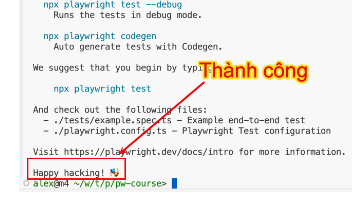
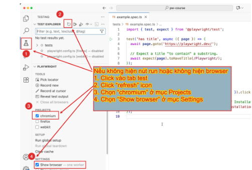
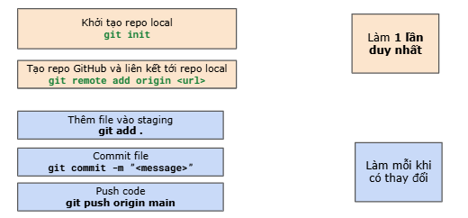

# Playwright

## Playwright là gì?
- Là 1 framework
- Tiền thân là puppeteer, được MS tài trợ và phát triển

### Ưu điểm:

- **Cross browser**: Hỗ trợ các trình duyệt phổ biến: chrome, edge, firefox, safari    
- **Cross platform**: Code 1 lần, chạy trên các nền tảng phổ biến (Win, Linux, MacOS)
- Tính năng sịn xò: auto waiting, auto-retry assertion giúp giảm flacky tests
- Report đầy đủ thông tin:
    - Pass/fail theo từng loại browser
    - Chi tiết ở từng thời điểm: gọi api nào, response trả về gì, ứng với dòng code nào
- Code gen
    - Thao tác để sinh ra code

## Tại sao học Playwright Typescript?
- Dễ cài đặt
- Cú pháp đơn giản, dễ học
- Framework trending

## Giải thích các tool đã cài

**NVM** = node version manager = quản lý các phiên bản node js

**NodeJS** = công cụ để chạy code

2 option: 
- cài trực tiếp nodejs vào máy
- cài thông qua NVM

Chọn NVM vì dễ chuyển đổi phiên bản nodejs

**Git** = quản lý source code
**Github** = chia sẻ code, làm việc nhóm

## Cấu hình Git

Trước khi làm việc với Git cần 1 số cấu hình mặc định:
- config username (tên người dùng)
    - `git config --global user.name "<tên bạn>"`
- config email (địa chỉ mail)
    - `git config --global user.email "<email>"`
- config branch default (nhánh mặc định)
    - `git config --global init.defaultBranch main`

## Cài đặt Visual Studio Code

- VSCode = IDE = intergrated development environment
    - Là công cụ để viết code
    - Cài đặt Playwright extension

Đổi terminal mặc định:
- Window Powershell mặc định trên Win
- Powershell hay bị chặn/ lỗi vặt
- => dùng Git Bash
- Ctrl+Shift+P : Hiển thị hộp thoại
- Tìm kiếm: Terminal default
- Chọn: Terminal: Select default profile
- Chọn Git Bash

## Kết nối với GitHub

- SSH key:
    - Cặp khóa 2 cái
        - id_rsa: cần giữ bí mật
        - id_rsa.pub: có thể gửi cho người khác
    - Giúp xác thực trở nên dễ dàng hơn
    - Lưu ở ~/.ssh
    - "~" đại diện cho thư mục home
- Home ở Windows: 
    - C:\Users\{username}
- Home ở Linux/MacOS
    - /Users/{username}
- Lệnh tạo SSH keys:
    - ssh-keygen -t rsa -b 4096 -C "your_email@example.com"

- Lấy nội dung SSH key:
    - cat ~/.ssh/id_rsa.pub
- Truy cập: https://github.com/settings/ssh/new để thêm ssh key

## Chạy test đầu tiên

- Tạo thư mục mới
- Mở thư mục bằng VS Code
- Mở terminal
- Chạy lệnh:
    - `npm init playwright@latest`
    - Liên tục gõ Enter

## Đưa code lên GitHub

### Tạo repo

- Tạo repo:
    - Truy cập: https://github.com/new
    - Điền tên repository
    - Chọn "Public"
- Khởi tạo:
    - Khởi tạo repo local `git init`
    - Liên kết repository vừa tạo với Git: `git remote add origin <ssh_link>`
    - Thêm code `git add`
    - Thêm commit `git commit -m"init project"`
    - Push code `git push origin main`